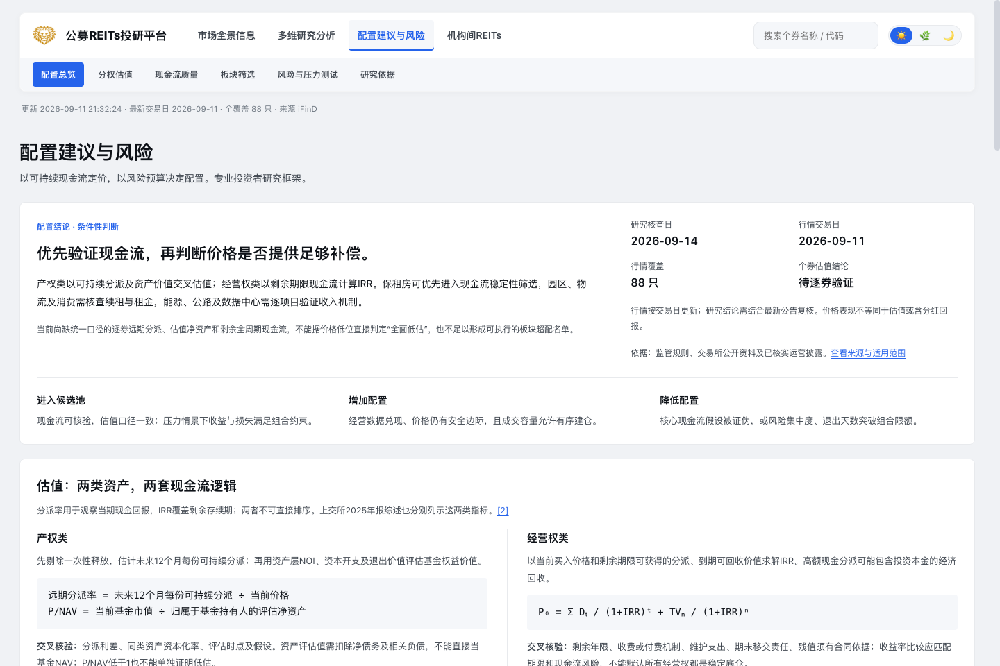

# 配置研究与布局修改说明

配置研究页以可验证现金流、分权估值及风险预算为主线，替代原先以多维状态灯和仓位倾向为主的展示。二级导航由九项收敛为六项，详情按需展开，板块进入条件与证伪信号并列展示。

- 顶部导航压缩，统一主题强调色；修复搜索下拉框被导航裁切的问题。
- 桌面端采用结论与数据状态双栏、产权与经营权并排比较；手机端纵向阅读，宽表局部滚动。
- 新增约7,800字符研究备忘录，引用8项监管、交易所及运营披露资料。
- 原始行情、财务及历史研究数据保持不变；原advice数据不再驱动当前页面评级。
- 增加板块研究方向筛选与独立估值压力测试；假设不回写原始数据。
- 行情加载失败时仍展示静态研究正文；研究章节支持地址锚点。

## 验证

`npm test`：21项通过，涵盖现金流现值独立校验、参数边界、空值样本及布局契约。JavaScript语法、Shell语法与Git差异空白检查通过。

浏览器核查：桌面1440×960、手机390×844；三种主题；板块筛选；两类模型切换及参数变更；主导航；研究与机构间REITs加载；宽表局部滚动。两个视口均未出现整页横向溢出。独立端口返回行情503时，静态研究仍可阅读。

## 适用限制

研究为条件性筛选框架。统一口径的逐券远期分派、评估净资产与剩余现金流尚未齐备，未生成个券买入名单、实时评级或组合权重。未执行生产部署。

[完整研究](../../research/allocation-research-2026-09-14.md)

